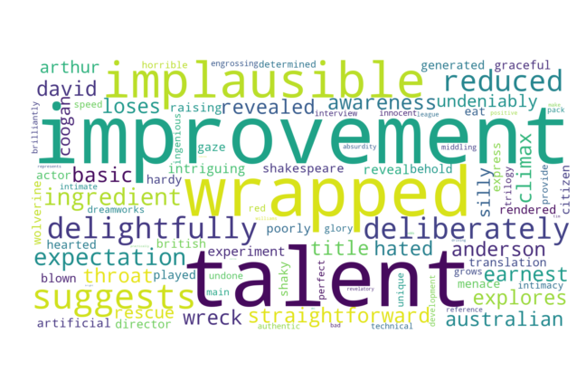
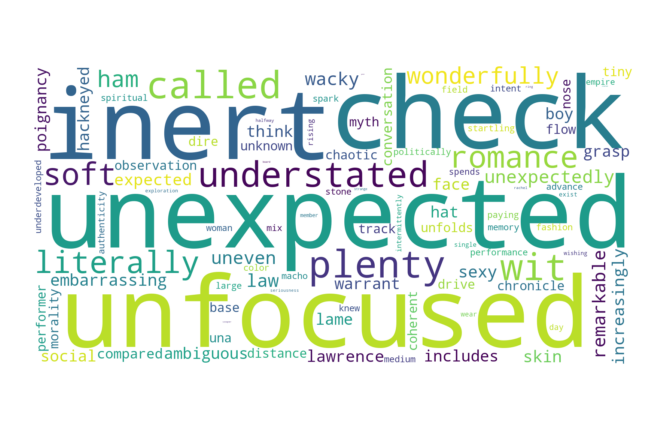
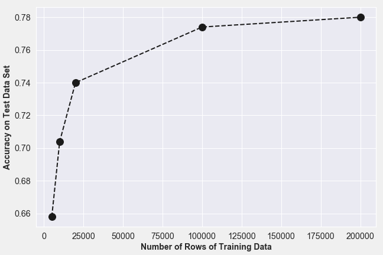

# Rotten or Fresh?

### by: Joseph T. Tustin

WHAT IS THE TOMATOMETER®?
The Tomatometer score – based on the opinions of hundreds of film and television critics – is a trusted measurement of critical recommendation for millions of fans.
Back in the days of the open theaters, when a play was particularly atrocious, the audience expressed their dissatisfaction by not only booing and hissing at the stage, but also throwing whatever was at hand – vegetables and fruits included.
The Tomatometer score represents the percentage of professional critic reviews that are positive for a given film or television show. A Tomatometer score is calculated for a movie or TV show after it receives at least five reviews.
When at least 60% of reviews for a movie or TV show are positive, a red tomato is displayed to indicate its Fresh status.
When less than 60% of reviews for a movie or TV show are positive, a green splat is displayed to indicate its Rotten status.

The Rotten Tomatoes Movie Review dataset consists of over 420,000 reviews which are in the form of simple sentences.  These reviews are classified as either positive or negative.  This capstone project goes through the process of building a model to predict the class of the review.  With random guessing, we would have a baseline predictive ability of 50%.

## Table of Contents
1. [Problem Statement](#ProblemStatement)
2. [Text Cleaning](#TextCleaning)
3. [Methodology](#Methodology)
4. [Results](#Results)
5. [Future Work](#FutureWork)

## Problem Statement
In a world where we generate 2.5 quintillion (10^18) bytes of data every day, sentiment analysis has become a key tool for making sense of that data. This has allowed companies to get key insights and automate all kinds of processes.

Natural Language Processing is hard!  Words (unigrams) have meaning.  Combinations of words (bigrams and trigrams) can hold even more meaning.  However, despite all this information that words and combinations of words hold, there can still be double meanings, sarcasm, and contradictory text.  It is estimated that given some random text only 65% of  all people will agree on its given meaning.

Positive Review
“Manakamana doesn't answer any questions, yet makes its point: Nepal, like the rest of our planet, is a picturesque but far from peaceable kingdom.”

Positive Review
“Wilfully offensive and powered by a chest-thumping machismo, but it's good clean fun.”

Negative Review
“It would be difficult to imagine material more wrong for Spade than Lost & Found.”

Negative Review
“Despite the gusto its star brings to the role, it's hard to ride shotgun on Hector's voyage of discovery.”

I worked on this Dataset as part of my second capstone at Galvanize.  In my original Capstone project,  I used a Multinomial Naive Bayes model for its ease of use and relative success in the field of natural language processing.  Other recommended models included logistic regression, support vector models, recurrent neural networks, and convolutional neural networks.  My first naive bayes model achieved a training accuracy score of .92 and a test accuracy score of .74   These scores were achieved by switching to a tfidf matrix over a term frequency matrix.  Results were also improved by incorporating bigrams.  Conclusions were that the model was overfit.  Also, an analysis of misclassification words could be used to edit the stop-words and improve the accuracy.  I also suspected that the relative importance of words in a tfidf matrix could be binned and the weight could be changed based on looking at a word_cloud image.  It appeared at though words in bin 3 or 4 would be the most important. Let's see it we can improve the model.

In this second go round.  I wanted to improve the lemmatization of my token matrix.  I wanted to play around with using an ensemble model to improve the  accuracy as well as a model that featured bigrams, trigams, and quadgrams.  I wanted to perform a cross-validation and grid search to fine tune my model (I also thought about creating a pipeline to streamline my model creation).  I wanted to perform my training on a large training set using AWS.  In the first go round, my feature size to data size was 1:1.  I thought that performance could be greatly in hanced using a larger data set and 1:4 ratio.  And, I wanted to create a flask app to allow users to enter their own opinions and observe the sentiment analysis. If I can get to it, I want to compare the performance to a neural network or look at a comparison with doc2vec which is based on a wikipedia trained neural network.  

## Text Cleaning 

Text cleaning is an important first step in natural language processing.  After text cleaning, the simplified words in the reviews must be turned into a numerical matrix using count vectorization as well as tf-idf factorization.  The typical work flow for text cleaning is shown below:

"image"

Once this process has been completed,  the data from the previously listed reviews is shown below:

['manakamana', 'answer', 'question', 'yet', …]
['wilfully', 'offensive', 'powered', 'chest', …….]
['would', 'difficult', 'imagine', 'material', ‘wrong’,..]
['despite', 'gusto', 'star', 'brings', 'role', ‘hard’,..]

As a picture can be worth a thousand words, the word clouds shown represent the frequency of the most common words as seen in both the positive and negative reviews.  Words, such as “improvement”, “talent”, and “delightfully” stand out as being associated with positive reviews.  It is interesting to note that some of the words associated with the most value appear to have smaller frequency count sizes.

This observation further validates the choice to use term frequency - inverse document frequency as a numerical vectorization method.   Please note the use of “unfocused”, “inert”, and “understated” in the word cloud of negative reviews shown below.

## Methodology 

With the normalized, numerical matrix representing the words in each of the reviews, models were created with a small subset of the data using Naive Bayes, Random Forest, and Logistic Regression to find the best predictive model while hyper tuning the model parameters using grid-search with cross-validation.

**Table 1**: Modeling Results

|    |   Training Accuracy Score |   Test Accuracy Score |
|---:|-----------:|-----------------------:|
|  Naive Bayes |       0.78   | 0.73 |   
|  Logistic Regression |       0.80   | 0.70   |
|  Random Forest |       0.65   | 0.62  |

Once the best model (Naive Bayes) was chosen, the model was scaled up to work on a larger dataset using an AWS m5 instance.  With the finalized model, a Flask app was created to allow users to interact with the model.

## Results 

The final model was based on a training data set of 100,000 reviews.  The model was scored on a test set of 25,000 reviews.  It has an accuracy, precision, and recall equal to 0.78. Not Bad for our exploratory purposes!!!

In a world where we generate 2.5 quintillion (10^18) bytes of data every day, sentiment analysis has become a key tool for making sense of that data. This has allowed companies to get key insights and automate all kinds of processes.

## Future Work 
1. dhkdh
2. djdj
